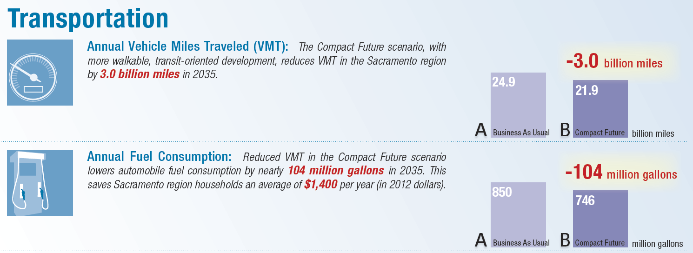

## Analysis Modules

UrbanFootprint supports comprehensive analysis of scenarios subject to variations in land use patterns and technical policies. Analysis modules are generally run following the completion of a
scenario, or at break points during scenario development to
evaluate performance. Run times vary according to the complexity of the modules, with some requiring a few minutes or more.

The flowchart below illustrates connections among the analysis modules, which include building energy use, water use, fiscal impacts, transportation, and public health. Greenhouse gas (GHG) emissions and household cost metrics are components of building energy and transportation analysis. This guide briefly outlines the analysis module outputs and underlying methodologies.

For reference, the [UrbanFootprint Technical Documentation](links/UrbanFootprint_v1.0_Technical_Documentation.pdf) offers a more detailed description of the analysis methodologies developed for version 1.0 of the model, though note that it does not reflect more recent advancements. Updated information about the public health model is available; see the [Public Health](/analysis_modules/#public-health) section for links.

### Running the Analysis Modules

To run the analysis modules and view outcomes:
1.	Click the ‘Analysis’ tab at the far right side of the interface to expand the analysis module panel.

2.	Select a module from the drop down menu at the top of the analysis module panel.

3.	Click the ‘Run Module’ button.

    This step will run the selected model and output summary metrics to the analysis module panel. Depending on the model, this may take a few minutes. Mapped outcomes can then be viewed by selecting layers in the ‘Analysis Results’ section on the left side of the interface.

### Building Energy Use

UrbanFootprint models building energy use for all new and existing residential and commercial buildings. Scenarios vary in their building energy use profiles due to their building program, the location of new growth, and policy-based assumptions for improvements in energy efficiency. Costs and GHG emissions associated with energy use, in turn, vary according to policy-based price and emissions rate assumptions.

Summary metrics include:

-   Total energy use
-   Residential energy use
-   Commercial energy use
-   Residential energy use per dwelling unit
-   Commercial energy use per employee

#### Model Methodology
Within the model, energy use is determined by three types of variables: building characteristics, climate zone, and efficiency factors. Building characteristics and climate zone determine what baseline per-residential unit or per-commercial square foot factors (derived from survey data) are used to calculate energy use. Reductions are then applied to the resulting baseline estimates to reflect the implementation of energy efficiency and conservation policies into the future.

##### Baseline Energy Use Factors

Baseline energy use factors quantify electricity and natural gas demand per residential unit or commercial square foot by building type and climate zone. Building characteristics are tied to scenario composition, while climate zone is location-dependent. Residential factors vary by California Energy Commission (CEC) Title 24 climate zones, while the commercial factors vary by CEC Forecasting Climate Zones (FCZ).

**Residential baselines**

Residential units in are classified by type, including small- and large-lot single family, townhome, and multifamily. For California, UrbanFootprint uses factors based on California Energy Commission (CEC) 2009 Residential Appliance Saturation Survey (RASS) data. These factors represent base-year energy use, with future-year energy use estimated in terms of reductions from base year estimates.

RASS data can be filtered by a range of geographic, building, and household characteristics. Per-unit baselines are estimated by summarizing the data by climate zone, building type, and square footage. For energy modeling purposes, UrbanFootprint classifies the single family detached types into two simple categories: small lot and large lot. The table below shows how the RASS building type and unit size categories are associated with the UrbanFootprint building types.

**Commercial baselines**

Baseline commercial energy use factors specify the amount of electricity and natural gas used annually per square foot for commercial buildings. In California, these rates are based on CEC 2006 Commercial End-Use Survey (CEUS) data, which provide energy intensities (EI) – energy use per square foot – by end use for 14 building types, classified by CEC Forecasting Climate Zone. UrbanFootprint uses total energy intensities to include all end uses surveyed. The table below shows the schema of the CEUS commercial energy use factors, populated with baseline electricity use. These factors are applied to the building square footage in each of these categories as estimated by UrbanFootprint.

##### Energy Efficiency Assumptions

Energy efficiency policies are a major determinant of building energy use. New buildings are expected to meet increasingly higher standards for new construction, while the population of existing buildings is expected to exhibit improved performance as a result of buildings being retrofitted or replaced. UrbanFootprint applies two types of energy use reduction factors to express these effects on the various populations of new and existing buildings: 1) *new construction efficiency*, which is applied to reflect the implementation of higher efficiency standards and policies into the future; and 2) *retrofit efficiency*, which is applied to reflect energy savings due to building improvements made through retrofits and minor renovations.

**New construction efficiency**

New construction includes new buildings and wholesale replacement and major renovations. This includes buildings built on greenfield land, those constructed through infill or redevelopment, and those built as replacements of existing buildings – each of these categories are treated as new construction.  The “new construction efficiency” factor can be set to reflect specific energy-saving policies for new construction, such as California’s Title 24 building standards, as well as local green building codes. The factor is expressed as a set of horizon-year energy use reduction targets (e.g., for 2020, 2035, and 2050) from baseline energy use. Different sets of targets can be applied to test specific policies for residential and commercial energy use, and the electricity and natural gas components of each.

Between horizon-year targets, the reductions are assumed to deepen at a steady rate. Thus, a multifamily unit built in 2025 would use less energy per year than the same type of unit built in 2015 – a rate which persists thereafter. By default, growth is assumed to occur at a steady rate between horizon years – that is, an equal number of units are allocated to each year over a defined period, though assumptions about the pace of new growth can be varied.

Within UrbanFootprint, a spreadsheet-based module is used to project forward the effects of deepening reductions over time to an end-state year – or in other words, convert horizon-year reduction targets into effective end-state reductions. A policy for new construction efficiency that meets a 20% reduction by 2020, a 50% reduction by 2035, and an 80% reduction by 2050 rate, for example, can be represented by a 41% reduction applied to all homes constructed over the period 2010 to 2050.

**Retrofit efficiency**

Energy use in the population of existing buildings can be expected to decline over time as a result of buildings being retrofitted to achieve greater energy performance. Similarly, energy use in the population of “new” buildings (those built within the time span of a scenario) can be expected to be further reduced due to retrofits in years subsequent to their construction.  The number of homes, or amount of commercial floor space, that undergo retrofits is determined by a retrofit rate assumption, taken as a percentage of building stock in each year. (This retrofit rate is also used in building water use calculations.)

The model uses a “retrofit efficiency” factor to reflect the savings potentials for residential and commercial electricity and natural gas use. This factor is expressed in terms of horizon-year target reductions from baseline (the same way that the new construction efficiency factor is expressed). The resulting end-year reductions are applied to the numbers of new and existing buildings that are assumed to be retrofitted over time.

**Policy basis for assumptions**

The table below shows a framework of default building energy use assumptions for California that represent three distinct policy directions: business-as-usual (BAU) performance, adopted policy, and aspirational policy. End-state targets are linked to specific years. Energy use in interim years is calculated according to a straight-line trend between the targets. The target years shown are flexible; functionally, targets can be set to any year, provided assumptions can be found or developed for the select target year(s).

##### Building Energy Emissions and Costs

The GHG emissions and costs of electricity and natural gas use are calculated, in turn, on the basis of assumed emissions rates and retail energy prices into the future. Emissions rates vary based on the energy portfolio, with assumptions subject to different policy futures. Energy price assumptions may be projected according to trends, or otherwise asserted.

### Water Use

UrbanFootprint models residential and commercial water uses for all buildings in a base year and for future scenarios. Scenarios vary in their water use profiles due to their building program, the location of new growth, and policy-based assumptions about improvements in water efficiency over time. The costs and GHG emissions associated with water use, in turn, vary according to policy-based price and emissions rate assumptions.

Summary metrics include:

-   Total annual water use
-   Annual residential water use, indoor and outdoor
-   Annual commercial water use, indoor and outdoor

#### Model Methodology
Indoor and outdoor water use for residential and commercial buildings is modeled separately within UrbanFootprint. Indoor water use is estimated on a per-capita basis, while outdoor water use is estimated on the basis of irrigated area at the parcel scale.  Indoor and outdoor water use is first calculated according to baseline rates and then adjusted to account for the application of efficiency and conservation policies into the future.

##### Baseline Water Use Factors

Baseline water use factors quantify residential indoor water use per capita by building type, commercial indoor water use per capita by employment category, and outdoor water use per irrigated square foot by evapotranspiration zone. Building types are tied to scenario composition, while evapotranspiration zone is location-dependent.

**Indoor baselines**

Indoor water use varies according to household size and building type, with multifamily homes generally requiring slightly less water per capita than single family homes. Baseline indoor water use factors are expressed in terms of gallons per capita per day (gpcd). Indoor usage patterns generally do not vary significantly by climate or location (if the same building/fixture standards are in place), though indoor factors can be calibrated to regional or local data where available.

Indoor water use for commercial uses is estimated on a per-employee basis. This approach is based on existing research and data that estimates commercial and institutional water use in terms of gallons per employee per day (GED) by employment sector. These factors were derived from a combination of modeled and survey data, taking into account general water uses, such as building cooling and restroom use, as well as water uses that relate to specific employment sectors, such as food service or medical care. Because UrbanFootprint models outdoor water use separately from indoor water use, the landscape irrigation component of per-employee water use rates is excluded.

The model uses baseline per-employee indoor water use factors for three general categories: retail, office, and industrial. These factors represent average use across all North American Industry Classification System (NAICS) subsectors within each commercial category. The rates are applied to the numbers of jobs by category in each scenario, which is determined by base year data and allocations of future employment as specified by place and building types.

**Outdoor baselines**

Outdoor water use for residential and commercial buildings is calculated based on assumptions about amount of irrigated area, and per-acre watering needs based on climate. The irrigated acreage per residential unit, or per acre of a commercial building type, is estimated using lot size, impervious cover, and irrigated land percentage assumptions.

Per-acre landscape irrigation requirements are derived from reference evapotranspiration (ETo) values. Evapotranspiration values, which measure plant water loss to the atmosphere, vary according to climate. The California Department of Water Resources provides monthly and yearly average ETo values for 18 zones in the state, as shown in the figure below. These values, expressed in inches of water, are used to determine per-acre outdoor water demand per month or year. An evapotranspiration adjustment factor is applied as a multiplier to evapotranspiration values to reflect assumptions about plant types and irrigation efficiency. This method for estimating outdoor water demand is detailed by the California Department of Water Resources’ Model Water Efficient Landscape Ordinance. UrbanFootprint uses annual ETo values.

##### Water Efficiency Assumptions

Water efficiency policies are a major determinant of building energy use. New buildings are expected to meet increasingly higher standards for new construction, while the population of existing buildings is expected to exhibit improved performance as a result of buildings being retrofitted or replaced. Similar to the application of energy efficiency assumptions, UrbanFootprint applies two types of water use reduction factors to express the effects of policies for new and existing buildings: 1) *new construction efficiency*, which is applied to reflect the implementation of higher efficiency standards and policies into the future; and 2) *retrofit efficiency*, which is applied to reflect water savings due to building improvements.

**New construction efficiency**

New construction includes new buildings and wholesale replacement and major renovations. This includes buildings built on greenfield land, those constructed through infill or redevelopment, and those built as replacements of existing buildings – each of these categories are treated as new construction.  The “new construction efficiency” factor can be set to reflect specific water-saving policies for new construction. The factor is expressed as a set of horizon-year water use reduction targets (e.g., for 2020, 2035, and 2050) from baseline water use. Different sets of targets can be applied to test specific policies for residential and commercial water use, and the indoor and outdoor components of each.

Between horizon-year targets, the reductions are assumed to deepen at a steady rate. Thus, a multifamily unit built in 2025 would use less water per year than the same type of unit built in 2015 – a rate which persists thereafter. By default, growth is assumed to occur at a steady rate between horizon years – that is, an equal number of units are allocated to each year over a defined period, though assumptions about the pace of new growth can be varied.

Within UrbanFootprint, a spreadsheet-based module is used to project forward the effects of deepening reductions over time to an end-state year – or in other words, convert horizon-year reduction targets into effective end-state reductions. A policy for new construction efficiency that meets a 20% reduction by 2020, a 50% reduction by 2035, and an 80% reduction by 2050 rate, for example, can be represented by a 41% reduction applied to all homes constructed over the period 2010 to 2050.

**Retrofit efficiency**

Water use in the population of existing buildings can be expected to decline over time as a result of buildings being retrofitted with new systems, fixtures, and irrigation technologies. Similarly, water use in the population of “new” buildings (those built within the time span of a scenario) can be expected to be further reduced due to retrofits in the years subsequent to their construction.  The number of homes, or commercial buildings, that undergo retrofits are determined by a retrofit rate assumption, taken as a percentage of building stock in each year. (This retrofit rate is also used in building energy use calculations.)

The model uses a “retrofit efficiency” factor to reflect the savings potentials for residential and commercial indoor and outdoor water use. This factor is expressed in terms of horizon-year target reductions from baseline (in the same way that the new construction efficiency factor is expressed). The resulting end-year reductions are applied to the numbers of new and existing buildings that are assumed to be retrofitted over time.

To account for water use reductions resulting from continued minor improvements and conservation behaviors, the model applies an additional Upgrade Efficiency factor to all buildings. A percentage reduction is applied as an annual reduction from the annual energy use total of the replacement units of the base. Over time, a rate of 0.25% would compound such that units can achieve a maximum of about 11% in additional water savings to 2050.

**Policy basis for assumptions**

The table below shows a proposed framework of default water efficiency assumptions for California that represent three distinct policy directions: business-as-usual (BAU) performance, adopted policy, and aspirational policy. End-state targets are linked to specific years. Water use in interim years is calculated according to a straight-line trend between the targets.

##### Water Costs

The costs of water use are calculated, in turn, on the basis of assumed retail water prices into the future. Price assumptions may be projected according to trends, or otherwise asserted.

### Local Fiscal Impacts

Fiscal impact analysis allows users to compare the implications of varying forms of development on local expenditures and revenues. The UrbanFootprint 1.5 version of the model focuses on the impacts associated with new residential growth, accounting for the capital costs of new and upgraded local infrastructure; local operations and maintenance (O&M) costs to serve new and upgraded infrastructure; and major sources of city revenues.

#### Model Methodology

Fiscal impacts are calculated on the basis of per-housing unit and per-capita cost and revenue factors that vary by UrbanFootprint land development category (LDC: Urban, Compact, or Standard, as described below), refill or greenfield development condition, and housing type (single family detached large lot, single family detached small lot, single family attached or multifamily). The factors, originally developed by Strategic Economics and Calthorpe Analytics to estimate the fiscal impacts of statewide scenarios, are based on development impact fees, local general fund expenditures, housing market data, and other empirical data for representative places throughout California.

**Infrastructure costs**

One-time capital costs for local infrastructure are estimated on the basis of per-housing unit cost factors. The assumed factors are comprised of three component costs: streets and transportation, water supply, and sewage and wastewater.  The component costs can be added together to produce a per-unit total infrastructure cost by housing type and land development category. Assumptions for the Compact land development category also vary by development condition since the per-unit average costs associated with refill (infill or redevelopment) and greenfield development differ. Costs are assumed to remain constant over time.

**Operations and maintenance (O&M) costs**

Ongoing annual operations and maintenance (O&M) cost assumptions for local infrastructure focus on local spending related to engineering and public works functions.  These component costs produce a per-unit total O&M cost by housing unit type and land development category. Assumptions for the Compact land development category also vary by development condition since the per-unit average costs associated with refill and greenfield development differ. If desired, the component assumptions can be used to model costs for individual categories – for example, O&M costs for public works or engineering functions alone.

**Local revenues**

Ongoing annual local revenue assumptions include projected revenues from property taxes, property transfer taxes, and vehicle license fees. The per-unit assumptions vary by housing type and land development category. Assumptions for the Compact land development category also vary by development condition since the per-unit average costs associated with refill and greenfield development differ.

##### Land Development Categories

UrbanFootprint’s fiscal impacts analysis module is sensitive to cost and revenue variations among three Land Development Categories, and refill or greenfield development conditions. The LDCs – Urban, Compact, and Standard – represent distinct forms of land use, ranging from dense and walkable mixed-use urban areas well served by transit, to lower-intensity, less walkable places where land uses are segregated and most trips are made via automobile. Each UrbanFootprint place type fits into a single LDC.

The distinct forms of growth represented by the LDCs result in differences in fiscal performance.

The **Urban** LDC represents the most intense and most mixed of the Land Development Categories, which in most cases would be found within and directly adjacent to moderate and high density urban centers. Virtually all of the development that falls into the Urban LDC would be considered infill or redevelopment. The majority of housing in Urban areas tends to be multifamily and attached single family (townhome), with some small-lot single family homes.

The **Compact** LDC is less intense than the Urban category, but is nonetheless highly walkable and contains a rich mix of retail, commercial, residential, and civic uses. The Compact form is most likely to occur as new growth on the urban edge or as larger scale (ground-up) redevelopment within urban areas. Compact areas contain a rich mix of housing, from multifamily and attached single family (townhome) to small- and medium-lot single family homes.

The **Standard** LDC represents the majority of separate-use auto-oriented development that has dominated the American suburban landscape over the past five to six decades. Densities tend to be lower than that of the Compact LDC, and are generally not highly mixed or organized in ways that facilitate walking, biking, or transit service. While Standard can contain a wide variety of housing types, including attached and multifamily units, medium- and larger-lot single family homes tend to comprise the majority of this development form.

### Transportation

UrbanFootprint incorporates a comprehensive ”sketch” travel model that interacts with regional travel network data to produce estimates of vehicle miles traveled (VMT) for land use + transportation scenarios. In turn, the VMT estimates are used to calculate transportation-related costs, greenhouse gas (GHG) emissions, and pollutant emissions. The core of UrbanFootprint’s travel engine was adapted from the Mixed-Use Trip Generation (MXD) model developed by Fehr & Peers for the US EPA.

Summary metrics include:

-   Total VMT
-   VMT per household
-   VMT per capita
-   VMT per employee

#### Model Methodology

The UrbanFootprint travel model uses the findings from California and nationwide MXD research to quantify the transportation effects of differences in transportation and development form ranging from highly sustainable compact, mixed and transit-oriented forms to land use patterns that are more auto-dependent. This relies upon measurement of each of the following ‘8Ds’ for each micro-scale development area.

1.	Density -- Dwellings and jobs per acre of development.
2.	Diversity -- Mix of housing, jobs and retail, measured in terms of ratios such as jobs/housing, retail/housing and jobs mix (closeness to a balance among uses).
3.	Design -- Connectivity and walkability, measured in terms of how fine-grained the circulation networks through metrics of network density, such as walkable street intersections per square mile.
4.	Destinations -- Regional accessibility to activities from the regional travel model networks “skim matrices” of travel distances and travel times among all development areas or travel analysis zones (TAZs).
5.	Distance to Transit -- Proximity to fixed-guideway service measured from the UrbanFootprint development grid cell to the nearest transit stops, and expressed in terms of transit stops within walking radii of ¼ and ½ mile.
6.	Development Scale -- Absolute local amounts of population and jobs within the development grid cell’s neighborhood (critical mass and magnitude of compatible uses), measured in terms of a ½ mile walking radius.
7.	Demographics -- Household size, income and auto ownership of the residential development types contained in the development area.
8.	Demand Management – Automobile travel disincentives, including regional pricing of auto travel through fuel costs, mileage-based fees and taxes and parking charges. (This method has been developed, but is not implemented in UrbanFootprint 1.5.)

UrbanFootprint quantifies the relationships to the first seven “Ds” through a series of equations from a rigorous statistical study (Traffic Generated by Mixed-Use Developments—Six-Region Study Using Consistent Built Environmental Measures, prepared for the US EPA and reviewed by the American Society of Civil Engineers) that developed hierarchical models that capture the relationships between the “D” factors and the amount of travel generated by over 230 mixed-use developments of a wide variety of settings and sizes across the US, including the Sacramento and San Diego regions. The predictive accuracy of the methods were validated through field surveys of traffic at almost 30 other development sites, more than half of which are located in California, at locations in San Diego, Orange County, Sacramento and the San Francisco Bay Area.

The resulting method, known as the MXD method, uses a series of equations to estimate the likely degree to which a development area’s external traffic generation will be reduced due to development density, diversity, design, destination accessibility, distance to transit, demographics and development scale. UrbanFootprint uses the MXD method and other California research on the effects of various Demand Management strategies as its ‘8D’ travel engine.

UrbanFootprint combines the MXD estimates of trip generation by travel mode with regional information on transportation networks and travel distances among activities to compute measures of accessibility and vehicle miles traveled (VMT). For consistency with regional transportation policy and programs, UrbanFootprint draws this network information from regional travel models, reflecting (in California) the regions' Sustainable Communities Strategies (SCSs) and modal emphasis alternatives from their Regional Transportation Plans (RTPs).

##### UrbanFootprint inputs
The inputs to the travel model are summarized below.

*Land Use* (based on a half-mile buffer around each location):

-   Population
-   Employment
-   Dwelling units by type
-   Square feet of non-residential use by category: office, retail, service,
    public

*Urban Form* (based on a half mile buffer around each location):

-   Intersection density
-   Household size
-   Auto ownership

*Location and Context*

-   Employment within a one-mile radius
-   Jobs within 30 minutes by transit

##### Model outputs

The transportation model results can be summarized and mapped to compare impacts across scenarios. The map below, for example, shows projected VMT per household in the Sacramento area, modeled as part of the Vision California project by Calthorpe Associates (now Calthorpe Analytics). The charts that follow summarize the differences in projected VMT between two alternate land use scenarios.

**Transportation costs and emissions**

Costs and emissions estimates can be calculated, in turn, by applying input assumptions that vary according to projected policy and technological pathways. Inputs include fuel price; auto ownership and maintenance costs; vehicle fleet mix, fuel economy, and rates of pollutant emissions; and the carbon intensity of fuels and electricity.

### Public Health

UrbanFootprint estimates the impact of land use patterns and urban form on a range of health-related indicators. The public health metrics are derived from factors that are influenced by changes in urban form, including physical activity-related weight and disease incidences. Related costs can be estimated in turn to highlight the fiscal implications of comparative land use and transportation scenarios.

The public health module uses regression models built by Urban Design 4 Health (UD4H) that are grounded in primary research and travel and health survey data from California and throughout the country. The model uses demographic inputs and variables representing the built environment to forecast the amount of time spent in moderate and vigorous activity, proportion of the population that is overweight, and time spent in cars. These are then used to identify the incidence of weight and activity-related diseases and resulting costs.

#### Model Methodology

The form of the built environment influences physical activity – for instance, residents of a compact, mixed-use neighborhood are more likely to walk as a part of their regular routine, whereas residents of a low-density residential suburb are likely to spend more time in cars. UrbanFootprint measures the characteristics of urban form that have a demonstrated link to physical activity levels; these are processed into a form useable by the public health module as a set of pre-processes. The pre-processes used to measure the relevant aspects of urban form include:

1.	The walkability index
2.	The building use mix measurement
3.	The dwelling unit density measurement
4.	A network-based walkable street intersection count and density measurement

The public health engine models five primary weight and physical activity metrics for the adult population:

1.	Minutes per day of moderate and vigorous physical activity (MVPA)
2.	Daily time spent in cars
3.	Percent of the adult population that is overweight and obese
4.	Percent of the adult population that is obese
5.	Average BMI (body mass index)

The amount of physical activity influences the amount of calories burned, which influences body weight, which in turn influences certain health outcomes such as cardiovascular disease and diabetes. Physical activity is measured using average daily minutes of moderate and vigorous physical activity (MVPA) as well as adult daily time spent in cars; body weight is measured by average body mass index and the percent of the adult population that is overweight and obese; related health outcomes are measured as a separate step.

In this version (1.5) of UrbanFootprint’s health module, MVPA and average car time are not directly used as inputs to any models of health outcomes; rather, they are produced as indicators of the effects of urban form on physical activity levels. The health outcomes that depict the effects of the level of physical activity all flow from the models predicting adult overweight and obese percentages.

##### UrbanFootprint inputs and model outputs

UrbanFootprint scenarios are built upon a highly detailed “canvas” of data that constitutes a baseline assessment of existing land use, demographic characteristics, and other conditions, providing the context for scenario painting and the foundation for analysis. In building future scenarios, users assert changes to population and employment distributions and built form characteristics upon this base canvas of data.

The UrbanFootprint inputs to the public health model include:

*	Total population
*	Total households
*	Total employees
*	Gross population density
*	Gross employment density
*	Employment entropy index
*	Retail employment
*	Street intersection density
*	Natural land cover variables
*	Jobs within 45 minute transit commute
*	Proportion of employment with ¼ mile of fixed guideway transit stop
*	Trip production/attraction equilibrium
*	Percent of households with zero vehicles

Activity and health related outputs include:

* Proportion of people walking (at all) for transportation on any given day (travel survey model)
* Cumulative daily duration (in minutes) of walking for transportation (travel survey model)
* Proportion of people walking (at all) for transportation on any given week (health survey model)
* Cumulative weekly duration (in minutes) of walking for transportation (health survey model)
* Proportion of people walking (at all) for leisure on any given week (health survey model)
* Cumulative weekly duration (in minutes) of walking for leisure on any given week (health survey model)
* Proportion of people walking (at all) for transportation or leisure on any given week (health survey model)
* Cumulative weekly duration (in minutes) of walking for transportation or leisure on any given week (health survey model)
* Proportion of people biking (at all) for transportation on any given day (travel survey model)
* Cumulative daily duration (in minutes) of biking for transportation  (travel survey model)
* Proportion of people engaging in recreational physical activity (at all) on any given day (travel survey model)
* Cumulative daily duration (in minutes) of recreational physical activity (travel survey model)
*	Proportion of people taking a trip by auto (at all) on any given day (travel survey model)
* Cumulative daily duration (in minutes) of time spent in an auto (sedentary time) (travel survey model)
* Average BMI of CBG population (health survey model)
* Proportion of CBG population that is overweight or obese (BMI 25+) (health survey model)
* Proportion of CBG population that is obese (BMI 30+)  (health survey model)
* Proportion of CBG population with a K6 mental health score indicating moderate or serious psychological distress  (health survey model)
* Proportion of CBG population with self-reported poor general health (health survey model)

###### Further information
The following reports, prepared by Urban Design 4 Health (UD4H) and Calthorpe Analytics as part of a 2015 technical review process led by California state and regional agencies, provide detailed information about the public health model and its development:
*  *[California Public Health Assessment Model (C-PHAM): Methods, Data, and UrbanFootprint Application](links/UD4H_Calthorpe_CPHAM_July_2015.pdf)*

*  *[California Public Health Assessment Model: Final Data Development and Model Results](links/UD4H_Data_Development_Model_Results_Memo_June_2015.pdf)*
