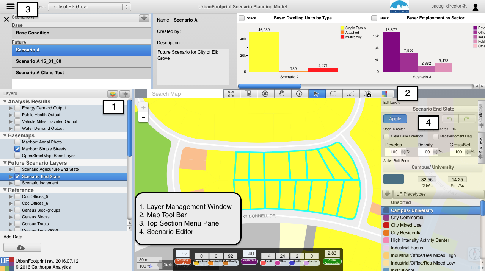
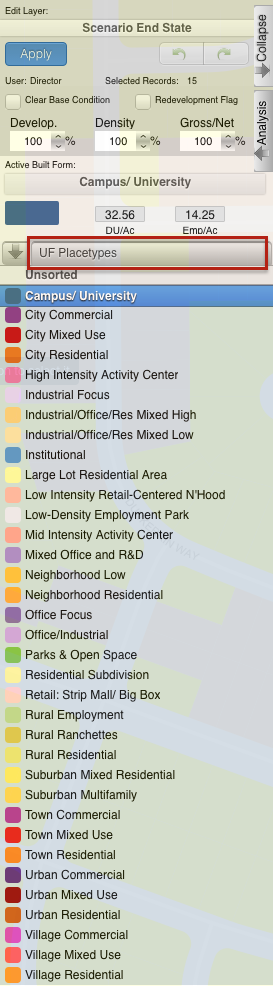
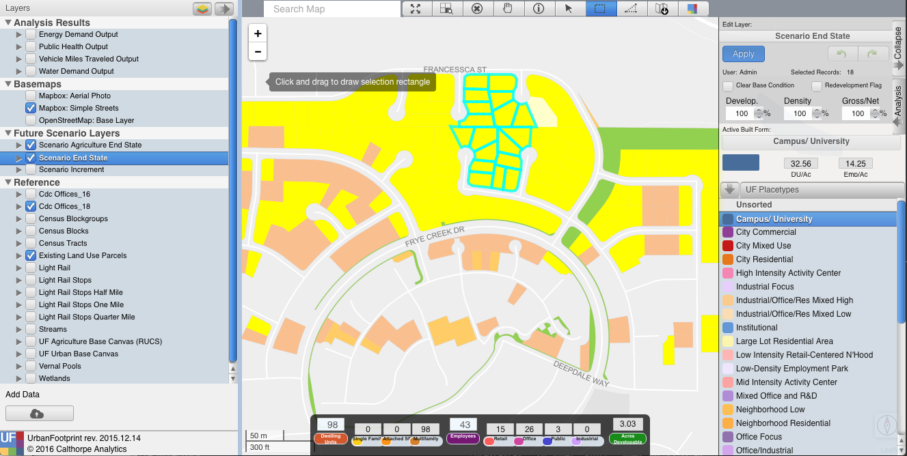
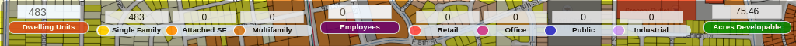
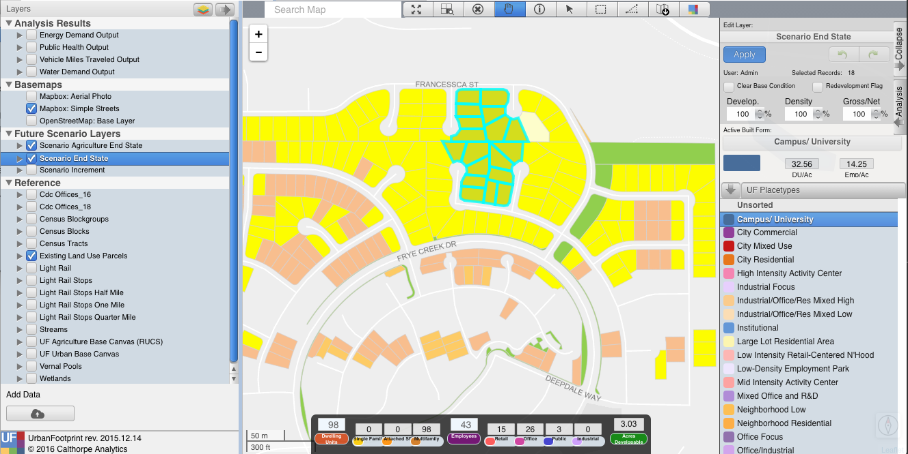
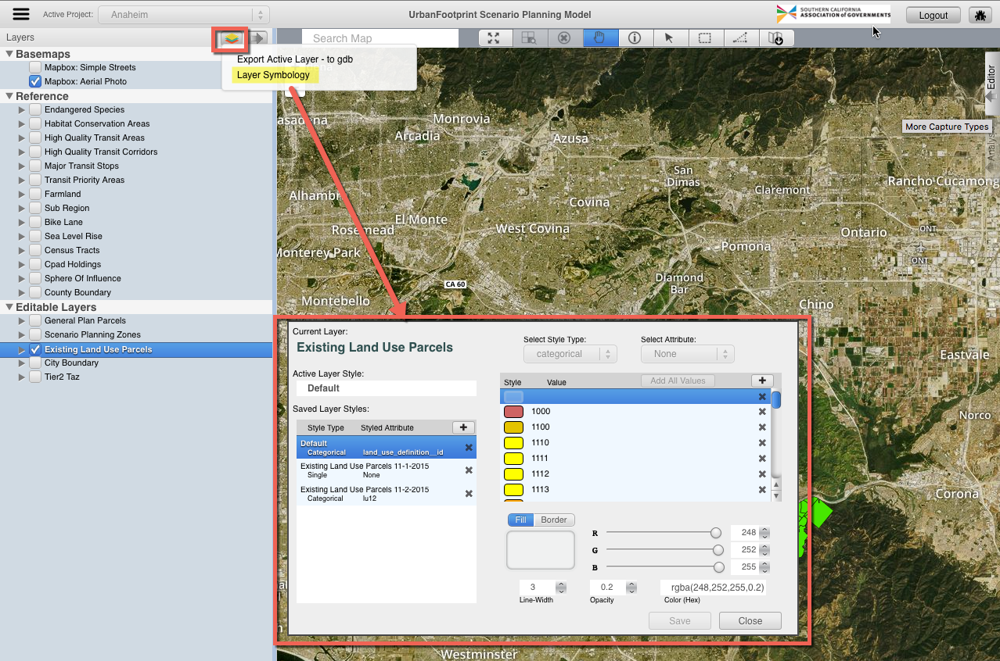

    

 

# UrbanFootprint - User Guide

UrbanFootprint is a web based, open source, scenario planning platform. This documentation
covers basic functionality for scenario planning and editing on UrbanFootprint's Scenario
Planning Platform.

## System Requirements

UrbanFootprint is accessed via a web page. For access, there are fairly minimal requirements:

* A relatively recent (purchased in last 5 years) desktop or laptop computer running the Windows, Mac OSX,
or Linux operating systems. The current system has not been optimized for tablet or touchscreen operating
systems or interfaces.

* Current version of Google Chrome web browser. Chrome is available via free download at
[https://www.google.com/intl/en/chrome/browser/](https://www.google.com/intl/en/chrome/browser/)

* Mouse, track-ball, or trackpad-based input device (essentially all desktop or laptop
computers have this capability).

> **Note:** If you experience difficulties in performing feature editing (e.g., feature
selection, querying, etc.) while being able to view maps on UrbanFootprint, first check your
internet firewall configuration with local IT support. The URL of UrbanFootprint should be added to the trust list of firewall configuration in order to avoid block
access by web filters set up locally.

## Site Map

## User Interface Overview

## 1. Layer Management Window

The Layer Management window on the left side of the user interface displays layers that
have been preloaded into UrbanFootprint, and that can be turned on for display and activated for
selection, editing, and queries.

The Layer Management window is broken up into 4 sections:

* **Analysis Results**
* **Basemaps**
* **Reference Layers**
* **Future Scenario Layers** *when viewing a future scenario*

The user can select an active layer by clicking on the layer name. The active layer will then highlight in blue.

> **Example:** Existing Land Use Parcels is visible on the map (checkbox) and is the active
layer (blue highlight).

**Important:** Any map selection, attribute query, export
layer, export csv initiated by the user will occur on the
active layer regardless of whether it is visible or not.

Each layer's legend is viewable by clicking on the arrow in front of the layer and then
expanding the arrow that appears below the layer.

[layers_icon]: <images/layers.png>
[reorder_arrow]: <images/reorder_arrow.png>
[reorder_layers]: <images/reorder_layers.png>

*Editable Layer*: Any layer under the Editable Layers section contains editable fields by
the user. See Appendix B for the list of editable fields.

![Layers Button][layers_icon] *Exporting Active Layer*: The user can export the Active
Layer to a geodatabase (.gdb) by clicking on the layers button on the Layers Tool Bar.
The user can initiate exporting by clicking ‘OK’ on a window that opens up once the user
clicks on the ‘Export Active Layer – to gdb’ button.  By default, the exported layer is
saved to the user's default Download folder.

![Reorder Arrow][reorder_arrow] *Reordering Map Layers*: The user can re-order layers on
the map by clicking on the arrow button on the right side of the Layers Tool Bar. This
button will open a window where the user can order the layers by clicking on the layer name
and dragging it into the order the user prefers within the visible list. This order
corresponds to the layer order on the map.

![Re-Order Layers][reorder_layers]

## 2. Map Tool Bar

Clicking on an icon on the map tool bar allows the user to zoom and navigate around the map
as well as select and identify map features. The user can hover their pointer to get the
‘tool tip’ to identify what button corresponds with each selector.

[selector_tools]: <images/selector_tools.png>
![Toolbar][selector_tools]

[extent_selector]: <images/extent_selector.png>
[zoom_selected]: <images/zoom_selected.png>
[cancel_select]: <images/cancel_select.png>
[hand_select]: <images/hand_select.png>
[pointer_select]: <images/pointer_select.png>
[box_select]: <images/box_select.png>
[polygon_select]: <images/polygon_select.png>
[info_select]: <images/info_select.png>
[download_select]: <images/download_selector.png>

![Zoom to Extent][extent_selector] *Zoom to Project Extent*: This tool allows the user to
zoom the current map to the project extent. The project refers to the project selected in
the Active Project dropdown in the header bar.

![Zoom to Selection][zoom_selected] *Zoom to Selection Extent*: This tool allows the user to
zoom the current map to the extent of selected features of the Active Layer.

![Clear Selection][cancel_select] *Clear Selection*: This tool clears the selected features
of the Active Layer.

![Navigate][hand_select] *Navigate*: This tool allows the user to navigate around the map by
clicking and dragging on the map. **Tip:** The user can hold ‘Shift’ and drag to zoom to a specific extent.

![Identify][info_select] *Identify*: This tool is activated when features are selected. The
Identify tool opens a moveable summary window where the user can view the attributes of the selected feature.

![Point Selector][pointer_select] *Point Selector*: The point selector selects a single
feature on the map.

![Rectangle Selector][box_select] *Rectangle Selector*: The rectangle selector selects the
features that intersect with a rectangle formed by the user clicking and dragging across the map.

![Polygon Selector][polygon_select] *Polygon Selector*: The polygon selector selects the
features that intersects with a user-defined polygon shape formed by the user defining each
node of the polygon by clicking on the map. Double clicking will stop forming the polygon selection.

![Download Selector][download_select] *Export Map*: The Export Map buttons takes a snapshot of
the current map and downloads the map as a jpg to the user's default Download folder.

> **Tip:** ***Multi-select*** can be activated by holding down the CTRL/CMD key (Windows/Mac)
for the Point ![Point Selector][pointer_select], Rectangle ![Rectangle Selector][box_select],
and Polygon ![Polygon Selector][polygon_select] Selectors.

## 3. Top Section Menu Pane

The top section menu drop down allows the user to toggle between Scenario Info and Data Explorer options. After clicking one of the options, the map selection will resize
to display the selected option.

[menu_button]: <images/menu_button.png>
[approval_merge]: <images/approval_icon.png>
[data_explorer]: <images/query.png>
[scenario_info]: <images/chart_icon.png>

The user can toggle between the following options by clicking on the menu button:

**Scenario Info:** The user can manage scenarios and view charts of key demographic statistics.

**Data Explorer:** The user can view and explore data in a table view and define attribute
queries and join tables to explore and select data.

## 3.1 Scenario Info ![Scenario Info][scenario_info]

The scenario info section allows users to manage their scenarios and displays charts on Population,
Households, and Employment on the active scenario.

### Managing Scenarios

The Manage Scenarios pane can be accessed in the Scenario Info Pane under the  dropdown.

The Manage Scenarios pane allows users to:

-   Select a scenario
-   Create a scenario
-   Delete a scenario

> Note: for editing a scenario see the Scenario Editor section

-   Create a New Scenario

> -   Click on the 'plus' icon next to an already existing scenario

*Note:* When starting a new scenario, it is a good idea to create a copy of
the Scenario A that is automatically created to use as the starting
point for any other new scenarios. Basically, the first thing that you
do is make a copy of Scenario A to a "New Scenario Template" and any
time you want to make another scenario you do so by making a copy of the
template.

-   Copy a Scenario

> -   Click on the plus icon next to a scenario name.

-   Delete a Scenario

> -   Click on the 'x' icon next to the scenario

-   Edit Scenario Details

> -   Double click and edit text
> -   Click Save

### Charts

Charts:

-   Provide immediate feedback on the Scenario
-   By Increment and End State
-   Population, Dwelling Unit, and Employment Totals
-   Dwelling Units by Type
-   Employment by Type

## 3.2 Data Explorer ![Data Explorer][data_explorer]

The data explorer query functionality and the map selector tools in UrbanFootprint are linked by default.
When a user selects features on the map with the map selector tools, the attributes will populate
in the query table window. If the user inputs an attribute query with no map selection, the map
will show the features selected from the attribute query. The user also has the option to use
attribute selections and map selections in combination.

**Querying Attributes**:
> attribute querying functionality utilizes SQL syntax to tell the database what features the
user would like to select. The user can select attribute names from a drop down list by clicking
on the arrow button next to the ‘Where’ clause or type them in.

*The following comparison/equality operators are supported:*

* Greater than : >
* Less than : <
* Greater than or equal to : >=
* Less than or equal to : <=
* Equals : =
* Not equal: !=

*For querying strings, the following syntax can be used (must be capitals):*

* BEGINS_WITH : String begins with a certain letter or group of letters
* ENDS_WITH : String ends with a certain letter or group of letters
* CONTAINS: String contains a certain letter or group of letters

*Multiple attribute queries are supported using the following syntax (must be capitals):*

* AND : SQL ‘and’ syntax, attributes must meet both query requirements
* OR : SQL ‘or’ syntax, attributes must meet either query requirements

> **Tip:** User can access drop down menus of attributes, operators, and AND/OR/parenthesis
syntax for a quicker query.

**Query Examples:**

 **Example 1**

 Returns all rows with land use code 1200 with a dwelling unit count greater than 2:

    land_use = 1200 AND du >= 2

 **Example 2**

 Returns all parcels with an apn that begins with 580 or an apn that begins with 104:

    apn BEGINS_WITH "580" OR apn BEGINS_WITH "104"

>**Note:** Any string query must have quotation marks around values.

**Joining Tables:**

UrbanFootprint allows the user to join and query spatial tables of different geography types and geographic
scales. The user utilizes these pre-defined join tables by selecting the desired table from the
drop down button in the query window. Having selected a table to join, the user will have access
to all fields in that join table.

>**Important:** If the user is querying a field from the join table that has the same name as a
field in the source table, the system defaults to the source table field. To query the join table
field, the user must write the *name_of_join_table.field_name* or select it from a drop down list
by clicking the arrow next to the 'Where' clause in the Query window.

**Query Options:**

The user has a number of options to form their query and to show helpful information in the user interface:

* Limit Results to Selected Area: If the user has selected features with a map selector tool and input
an attribute query, they have the option to limit the query result to the map selection or apply
them to the whole dataset.
* Clear Button: Clears the selection
* Query Button: Executes the query
* Select Attributes Shortcut: Allows user to select from a drop down of attributes
* Operators Shortcut: Allows user to select operators from a drop down list
* AND/OR shortcut: Allows user a shortcut to the common AND/OR/parenthesis operators

## 4. Scenario Editor

UrbanFootprint builds a scenario by adding the “change” or “increment”
that you’ve painted on top of a base conditions dataset. The combination
of the two produces what is known as the “End state.” The “End State”
represents what will be on the ground in the future (at what ever time
you’re targeting).

It is important to note that this isn’t just a simple addition or
replacement of the base condition with the change map. UrbanFootprint
implements rules that play several roles to control how overlaps are
handled.

*Infill/Redevelopment:* As you add changes you are also defining for
those changes whether any overlaps with the base condition should be
treated as Infill where much of the existing land use is left in place,
and additional development is added to fill in any available capacity.
Alternately the existing condition can be cleared from the parcel to
represent a full reconstruction of the location.

*Development Constraints:* Layers can be added to the scenario that
constrain development in locations that overlap. More on these later.

### Selecting Polygons to Edit

**Hand Selection (Painting)** Manual editing by selecting parcels using
one of the selection tools.

-   Point (image)
-   Line (image)
-   Polygon (image)

Select the tool

-   Box (drag and hold)
-   Polygon (click to draw the shape, double click to finish)

Draw the area you want to include in your selection

Any parcel that touches the shape will be selected

**Query Based**

-   Select parcels based on a query
-   Useful for large area edits or applying changes to a large number of
    parcels that satisfy a conditon.

Work Flow:

1.  Build your query
2.  Apply the query
3.  Apply the Place Type

### Scenario Builder

The scenario builder is where you specify the details about the place
type that you're about to apply to a set of selected polygons. While
you're not changing the fundamentals of the place type (to do that use
the Place Type editing tools), you can specify the percentage of the
available land that will have the place type applied to it, scale the
density of the place type down, and let UrbanFootprint know whether to
overwrite any existing place types (full redevelopment) or to use any
available vacant space in the polygon for the place type.

You can select the set of place types you're working with by clicking on
the button highlighted in red in the image to the left.

-   Development Pct.
-   Density Pct.
-   Gross/Net Pct.
-   Clear Base Condition
-   Redevelopment Flag
-   Apply
-   Undo / Redo

### Development Percent and Density Percent

Development and density percentage controls

Development Pct.:

> The percentage of the parcel land area to receive the place type. 50%
> means that 50% of the available land area will have the place type
> applied to it. In the graphic half of the parcel has development an
> the other half does not after applying the place type.

Density Pct.:

> The percentage of the place type densities to apply. 80% means that a
> place type with an average density of 10 du/acre will be applied
> having 8 du/acre. Note in the graphic the reduced intensity of the
> right parcel when compared to the left one.

### Gross/Net Percentage

Gross/Net Percentage Control

-   Allows assignment of a portion of the space to “No Use”
-   This is used to reserve space for other uses such as drainage,
    parks, or other infrastructure.
-   This is applied to the developable percentage.
-   For Example: If Dev. Pct is 90% and Gross Net is 90% then 9% of the
    parcel would be set aside as “No Use.”

> -   Assume that we've got a 100 acre parcel
> -   Developable space = (100 acres) \*90% = 90 acres
> -   No Use space percentage = 100%-90% = 10%
> -   No Use space = (90 acres) \* 10% = 9 acres

### Clear Base Condition and Redevelopment Flag

Clear Base Condition

> If selected this removes any prior place type from the parcel. If this
> is not selected, new place types are applied only to the portion of
> the parcel’s areas set in the Development Percent box.

**Example:**

Redevelopment Flag

> Manually flag a parcel as having been redeveloped. This control is
> specific to the version of UrbanFootprint with customizations for
> SACOG.

### Applying Land Use

To apply a land use to a parcel in the active scenario:

1.  Activate the End State layer
2.  Select the Parcels
3.  Select the Place Type using the Scenario Builder
4.  Adjust Settings for the Place Type
> 1.  Dev, Density, Gross/net: Specify the intensity with which the
>     Place Type will be applied.
> 2.  Clear Base Condition: Do you want to clear the existing
>     land (redevelopment) or not (infill).
> 3.  Redevelopment Flag: track where redevelopment was applied
5.  Apply Place Type

*While setting the densities, keep an eye on the handy pop-up at the
bottom of the screen that tells you how many dwelling units and
employees your settings will create.*

The final result:

To save changes to edited attributes the user must click the apply button when finished editing. If the user
changes the selected features without applying changes, those changes will not be saved.

### Undo / Redo
The undo and redo functionality allows users to undo or redo their most recent changes on the active layer.

***Undo: *** Clicking the undo button (back arrow) will undo the most recently saved change on the active scenario regardless of
the current selection.

***Redo: *** Clicking the redo button (forward arrow ) will redo the most recent change that was made using the undo button
regardless of the current selection.

**Tip: ** If the user hovers of the undo or redo buttons, they will see a message with the above definitions.

## 5. Analysis Modules

*Description coming soon*

## 6. Style Editor

The Style Editor allows the user modify the way a layer is dsiplayed on the map. A user can add new styles,
edit previously saved styles, and view the default style for the active layer's legend.

To open the Style Editor, the user can click on the layers button ![Layers Button][layers_icon] in the Layer
Management Window and select 'Layer Symbology' in the drop down.

The default style is not editable.

New styles can be added as single, categorical, or quantitative legends.

