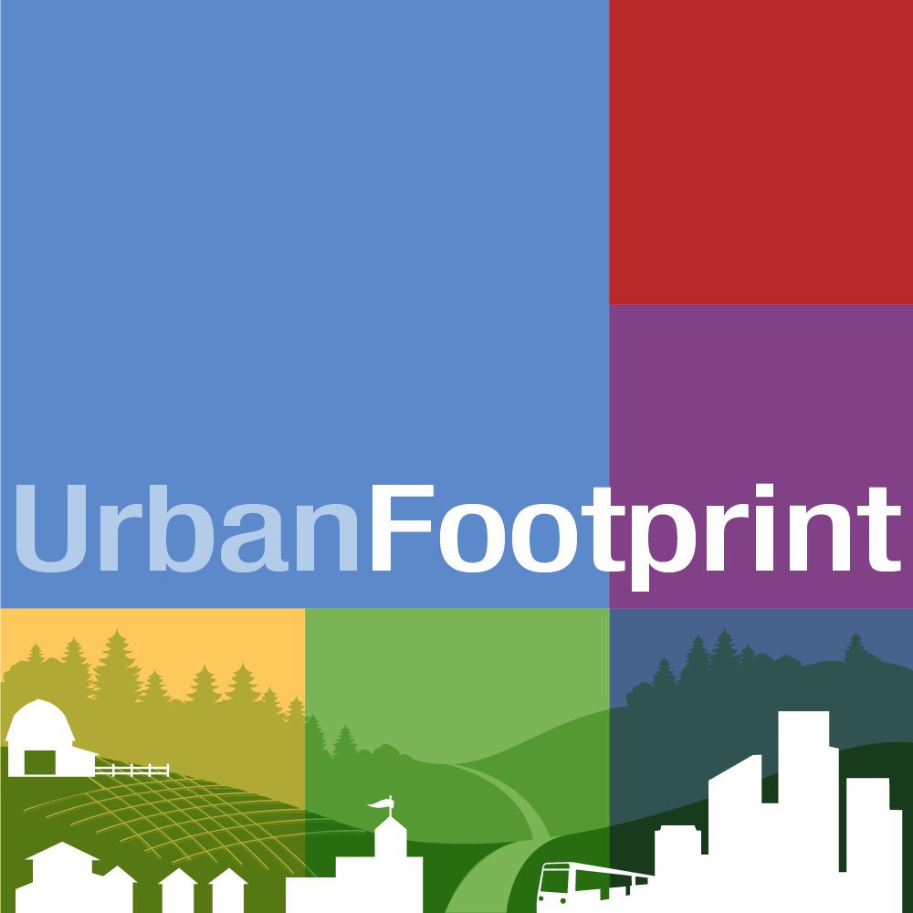

    

 

    

 

# UrbanFootprint v1.5 - User Guide

UrbanFootprint is a web based, open source, scenario planning platform. This documentation
covers basic functionality for scenario planning and editing on UrbanFootprint's Scenario
Planning Platform.
