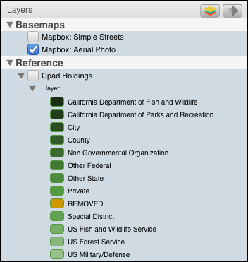

# Layer Management Window

The Layer Management window on the left side of the user interface displays layers that
have been preloaded into UrbanFootprint, and that can be turned on for display and activated for
selection, editing, and queries.

The Layer Management window is broken up into 4 sections:

1. Layers List
2. Layers Menu
3. Reordering Layers Menu
4. Upload

## 1. Layers List
The Layers List is broken up into 4 sections:

* **Analysis Results**
* **Basemaps**
* **Reference Layers**
* **Future Scenario Layers** *when viewing a future scenario*

The user can select an active layer by clicking on the layer name. The active layer will then highlight in blue.

> **Example:** Existing Land Use Parcels is visible on the map (checkbox) and is the active
layer (blue highlight).

**Important:** Any map selection, attribute query, export
layer, export csv initiated by the user will occur on the
active layer regardless of whether it is visible or not.

Each layer's legend is viewable by clicking on the arrow in front of the layer and then
expanding the arrow that appears below the layer.

> To edit the layer styling, use the layer symbology menu accessible in the Layers Menu

## 2. Layers Menu

The Layers Menu is accessed in the upper right section of the Layer Management Window via the button ![Layers Button][layers_icon].

The Layers Menu has 3 options:

1. Exporting Layer to gdb
2. Layer Symbology
3. Manage Layers

### Exporting Active Layer
![Layers Button][layers_icon] *Exporting Active Layer*: The user can export the Active
Layer to a geodatabase (.gdb) by clicking on the layers button on the Layers Tool Bar.
The user can initiate exporting by clicking ‘OK’ on a window that opens up once the user
clicks on the ‘Export Active Layer – to gdb’ button.  By default, the exported layer is
saved to the user's default Download folder.

### Layer Symbology

The Layer Symbology allows the user to modify the way a layer is dsiplayed on the map. A user can add new styles,
edit previously saved styles, and view the default style for the active layer's legend.

To open the Layer Symbology, the user can click on the Layers Menu button ![Layers Button][layers_icon] in the Layer
Management Window and select 'Layer Symbology' in the drop down.

The default style is not editable.

New styles can be added as single, categorical, or quantitative legends.

[layers_icon]: <images/layers.png>
[reorder_arrow]: <images/reorder_arrow.png>
[reorder_layers]: <images/reorder_layers.png>

### Manage Layers

The Manage Layers menu allows users to modify the layers visible in the Layers List. A user can
check or uncheck layers here to update the Layer List.

## 3. Reordering Map Layers
![Reorder Arrow][reorder_arrow] *Reordering Map Layers*: The user can re-order layers on
the map by clicking on the arrow button on the right side of the Layers Tool Bar. This
button will open a window where the user can order the layers by clicking on the layer name
and dragging it into the order the user prefers within the visible list. This order
corresponds to the layer order on the map.

![Re-Order Layers][reorder_layers]

## 4. Upload

Upload gdb and shape files directly into the SPM using the Upload button at the bottom left corner of the
page. (Also see [ArcGIS Integration](/arc_plugin) for importing layers from ArcMap directly to UrbanFootprint.)

Once the upload button is clicked, select the zipped gdb or shape file in the file selector.
The layer will start uploading immediately and is automatically added to the Layer Management Window
once completed. Uploaded layers are added as reference layers to the current project and are visible
to all users of that project.

>**Note:** The upload file size limit is 100 MB