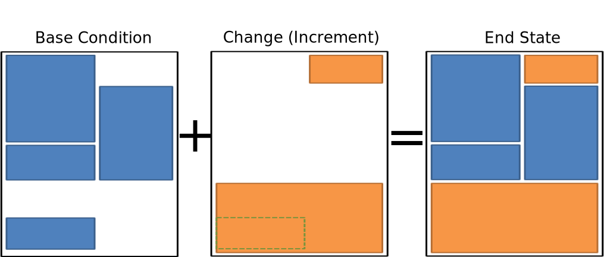
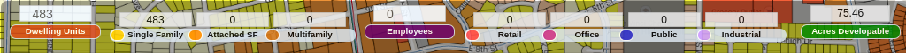
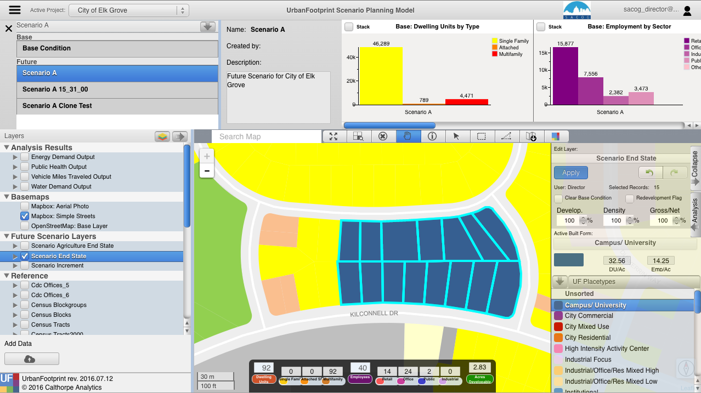

## Scenario Editor

UrbanFootprint builds a scenario by adding the “change” or “increment”
that you’ve painted on top of a base conditions dataset. The combination
of the two produces what is known as the “End state.” The “End State”
represents what will be on the ground in the future (at what ever time
you’re targeting).

It is important to note that this isn’t just a simple addition or
replacement of the base condition with the change map. UrbanFootprint
implements rules that play several roles to control how overlaps are
handled.

*Infill/Redevelopment:* As you add changes you are also defining for
those changes whether any overlaps with the base condition should be
treated as Infill where much of the existing land use is left in place,
and additional development is added to fill in any available capacity.
Alternately the existing condition can be cleared from the parcel to
represent a full reconstruction of the location.

*Development Constraints:* Layers can be added to the scenario that
constrain development in locations that overlap. More on these later.

### Selecting Polygons to Edit

**Hand Selection (Painting)** Manual editing by selecting parcels using
one of the selection tools.

-   Point (image)
-   Line (image)
-   Polygon (image)

Select the tool

-   Box (drag and hold)
-   Polygon (click to draw the shape, double click to finish)

Draw the area you want to include in your selection

Any parcel that touches the shape will be selected

**Query Based**

-   Select parcels based on a query
-   Useful for large area edits or applying changes to a large number of
    parcels that satisfy a conditon.

Work Flow:

1.  Build your query
2.  Apply the query
3.  Apply the Place Type

### Scenario Builder

The scenario builder is where you specify the details about the place
type that you're about to apply to a set of selected polygons. While
you're not changing the fundamentals of the place type (to do that use
the Place Type editing tools), you can specify the percentage of the
available land that will have the place type applied to it, scale the
density of the place type down, and let UrbanFootprint know whether to
overwrite any existing place types (full redevelopment) or to use any
available vacant space in the polygon for the place type.

You can select the set of place types you're working with by clicking on
the button highlighted in red in the image to the left.

-   Development Pct.
-   Density Pct.
-   Gross/Net Pct.
-   Clear Base Condition
-   Redevelopment Flag
-   Apply
-   Undo / Redo

### Development Percent and Density Percent

Development and density percentage controls

Development Pct.:

> The percentage of the parcel land area to receive the place type. 50%
> means that 50% of the available land area will have the place type
> applied to it. In the graphic half of the parcel has development an
> the other half does not after applying the place type.

Density Pct.:

> The percentage of the place type densities to apply. 80% means that a
> place type with an average density of 10 du/acre will be applied
> having 8 du/acre. Note in the graphic the reduced intensity of the
> right parcel when compared to the left one.

### Gross/Net Percentage

Gross/Net Percentage Control

-   Allows assignment of a portion of the space to “No Use”
-   This is used to reserve space for other uses such as drainage,
    parks, or other infrastructure.
-   This is applied to the developable percentage.
-   For Example: If Dev. Pct is 90% and Gross Net is 90% then 9% of the
    parcel would be set aside as “No Use.”

> -   Assume that we've got a 100 acre parcel
> -   Developable space = (100 acres) \*90% = 90 acres
> -   No Use space percentage = 100%-90% = 10%
> -   No Use space = (90 acres) \* 10% = 9 acres

### Clear Base Condition and Redevelopment Flag

Clear Base Condition

> If selected this removes any prior place type from the parcel. If this
> is not selected, new place types are applied only to the portion of
> the parcel’s areas set in the Development Percent box.

**Example:**

Redevelopment Flag

> Manually flag a parcel as having been redeveloped. This control is
> specific to the version of UrbanFootprint with customizations for
> SACOG.

### Applying Land Use

To apply a land use to a parcel in the active scenario:

1.  Activate the End State layer
2.  Select the Parcels
3.  Select the Place Type using the Scenario Builder
4.  Adjust Settings for the Place Type
> 1.  Dev, Density, Gross/net: Specify the intensity with which the
>     Place Type will be applied.
> 2.  Clear Base Condition: Do you want to clear the existing
>     land (redevelopment) or not (infill).
> 3.  Redevelopment Flag: track where redevelopment was applied
5.  Apply Place Type

*While setting the densities, keep an eye on the handy pop-up at the
bottom of the screen that tells you how many dwelling units and
employees your settings will create.*

The final result:

To save changes to edited attributes the user must click the apply button when finished editing. If the user
changes the selected features without applying changes, those changes will not be saved.

### Undo / Redo
The undo and redo functionality allows users to undo or redo their most recent changes on the active layer.

***Undo: *** Clicking the undo button (back arrow) will undo the most recently saved change on the active scenario regardless of
the current selection.

***Redo: *** Clicking the redo button (forward arrow ) will redo the most recent change that was made using the undo button
regardless of the current selection.

**Tip: ** If the user hovers of the undo or redo buttons, they will see a message with the above definitions.