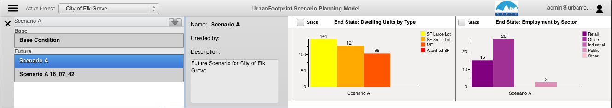
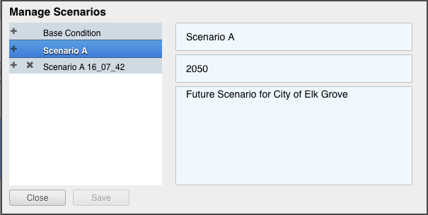
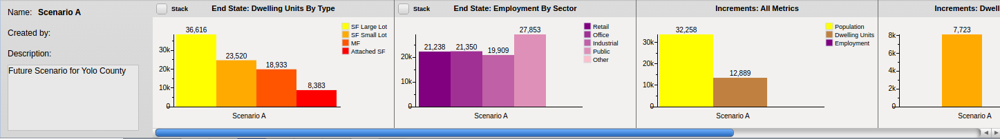

## Top Section Menu Pane

The top section menu drop down allows the user to toggle between Scenario Info and Data Explorer options. After clicking one of the options, the map selection will resize
to display the selected option.

[menu_button]: <images/menu_button.png>
[approval_merge]: <images/approval_icon.png>
[data_explorer]: <images/query.png>
[scenario_info]: <images/chart_icon.png>

The user can toggle between the following options by clicking on the menu button:

**Scenario Info:** The user can manage scenarios and view charts of key demographic statistics.

**Data Explorer:** The user can view and explore data in a table view and define attribute
queries and join tables to explore and select data.

## Scenario Info ![Scenario Info][scenario_info]

The scenario info section allows users to manage their scenarios and displays charts on Population,
Households, and Employment on the active scenario.

### Managing Scenarios

The Manage Scenarios pane can be accessed in the Scenario Info Pane under the  dropdown.

The Manage Scenarios pane allows users to:

-   Select a scenario
-   Create a scenario
-   Delete a scenario

> Note: for editing a scenario see the Scenario Editor section

-   Create a New Scenario

> -   Click on the 'plus' icon next to an already existing scenario

*Note:* When starting a new scenario, it is a good idea to create a copy of
the Scenario A that is automatically created to use as the starting
point for any other new scenarios. Basically, the first thing that you
do is make a copy of Scenario A to a "New Scenario Template" and any
time you want to make another scenario you do so by making a copy of the
template.

-   Copy a Scenario

> -   Click on the plus icon next to a scenario name.

-   Delete a Scenario

> -   Click on the 'x' icon next to the scenario

-   Edit Scenario Details

> -   Double click and edit text
> -   Click Save

### Charts

Charts:

-   Provide immediate feedback on the Scenario
-   By Increment and End State
-   Population, Dwelling Unit, and Employment Totals
-   Dwelling Units by Type
-   Employment by Type

## Data Explorer ![Data Explorer][data_explorer]

The data explorer query functionality and the map selector tools in UrbanFootprint are linked by default.
When a user selects features on the map with the map selector tools, the attributes will populate
in the query table window. If the user inputs an attribute query with no map selection, the map
will show the features selected from the attribute query. The user also has the option to use
attribute selections and map selections in combination.

**Querying Attributes**:
> attribute querying functionality utilizes SQL syntax to tell the database what features the
user would like to select. The user can select attribute names from a drop down list by clicking
on the arrow button next to the ‘Where’ clause or type them in.

*The following comparison/equality operators are supported:*

* Greater than : >
* Less than : <
* Greater than or equal to : >=
* Less than or equal to : <=
* Equals : =
* Not equal: !=

*For querying strings, the following syntax can be used (must be capitals):*

* BEGINS_WITH : String begins with a certain letter or group of letters
* ENDS_WITH : String ends with a certain letter or group of letters
* CONTAINS: String contains a certain letter or group of letters

*Multiple attribute queries are supported using the following syntax (must be capitals):*

* AND : SQL ‘and’ syntax, attributes must meet both query requirements
* OR : SQL ‘or’ syntax, attributes must meet either query requirements

> **Tip:** User can access drop down menus of attributes, operators, and AND/OR/parenthesis
syntax for a quicker query.

**Query Examples:**

 **Example 1**

 Returns all rows with land use code 1200 with a dwelling unit count greater than 2:

    land_use = 1200 AND du >= 2

 **Example 2**

 Returns all parcels with an apn that begins with 580 or an apn that begins with 104:

    apn BEGINS_WITH "580" OR apn BEGINS_WITH "104"

>**Note:** Any string query must have quotation marks around values.

**Joining Tables:**

UrbanFootprint allows the user to join and query spatial tables of different geography types and geographic
scales. The user utilizes these pre-defined join tables by selecting the desired table from the
drop down button in the query window. Having selected a table to join, the user will have access
to all fields in that join table.

>**Important:** If the user is querying a field from the join table that has the same name as a
field in the source table, the system defaults to the source table field. To query the join table
field, the user must write the *name_of_join_table.field_name* or select it from a drop down list
by clicking the arrow next to the 'Where' clause in the Query window.

**Query Options:**

The user has a number of options to form their query and to show helpful information in the user interface:

* Limit Results to Selected Area: If the user has selected features with a map selector tool and input
an attribute query, they have the option to limit the query result to the map selection or apply
them to the whole dataset.
* Clear Button: Clears the selection
* Query Button: Executes the query
* Select Attributes Shortcut: Allows user to select from a drop down of attributes
* Operators Shortcut: Allows user to select operators from a drop down list
* AND/OR shortcut: Allows user a shortcut to the common AND/OR/parenthesis operators

