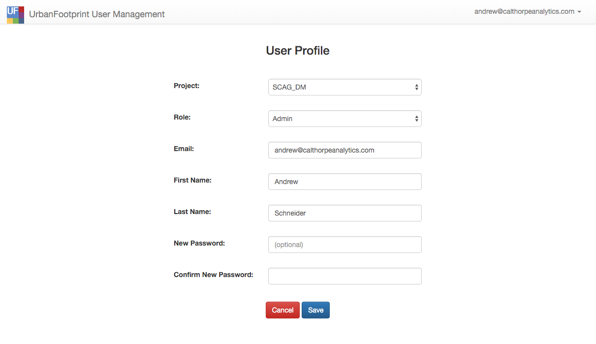
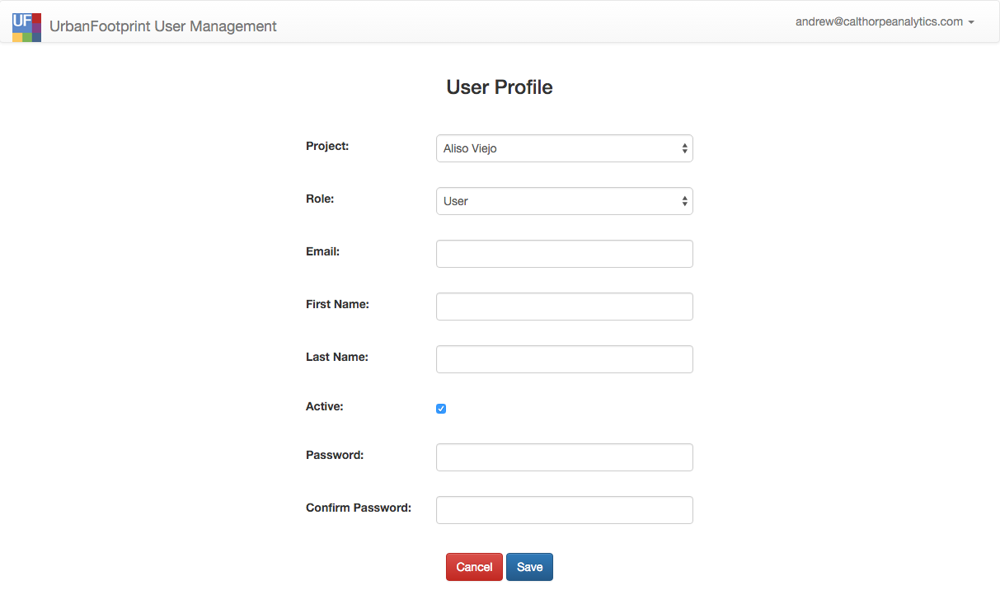
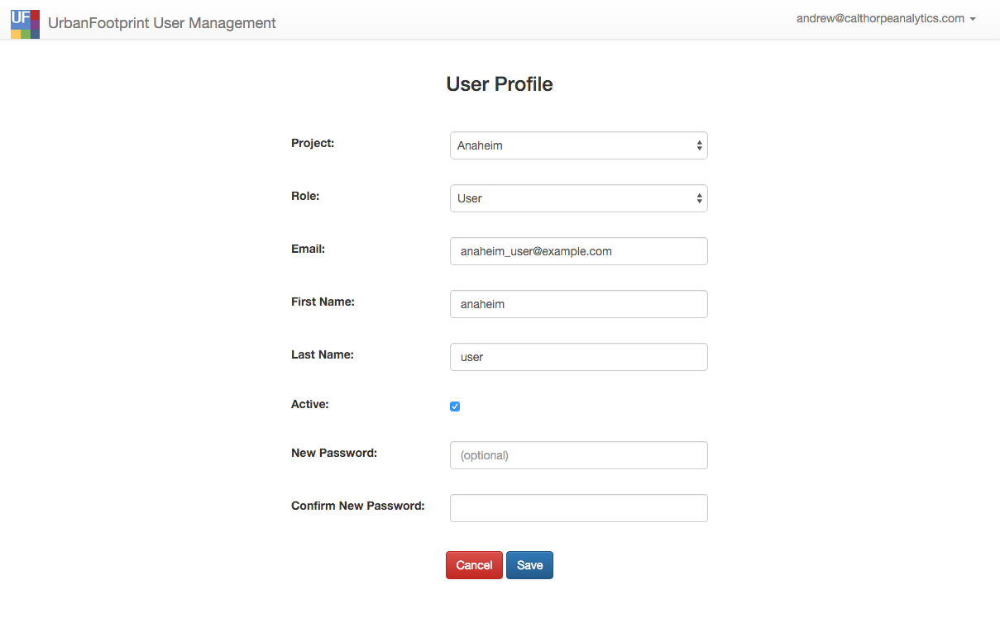
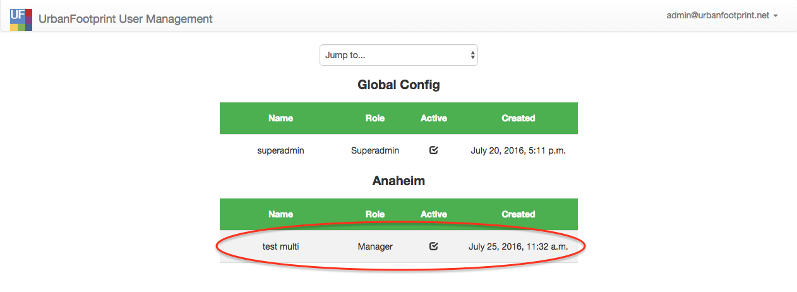
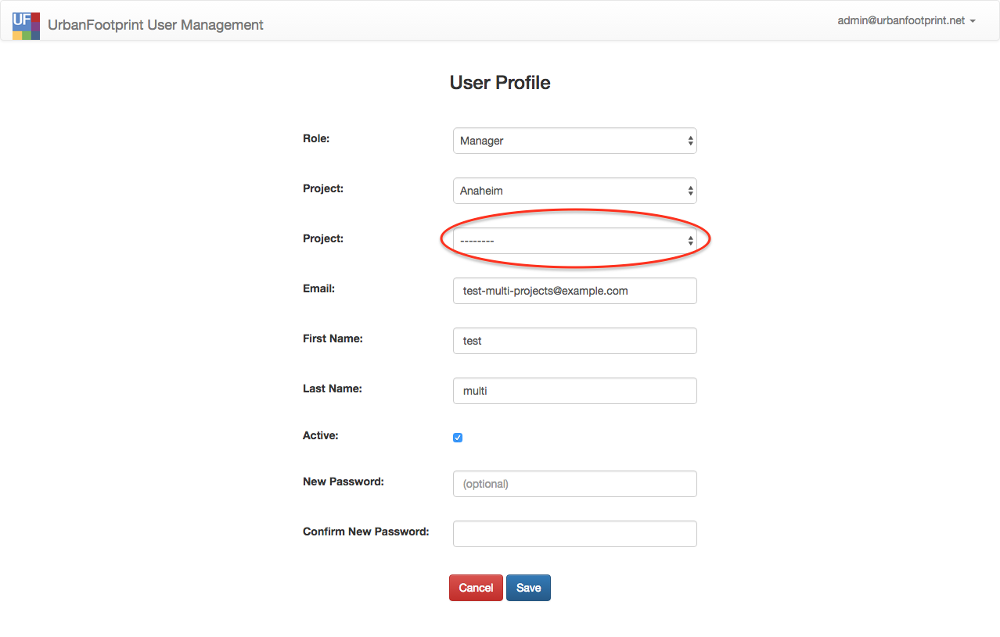
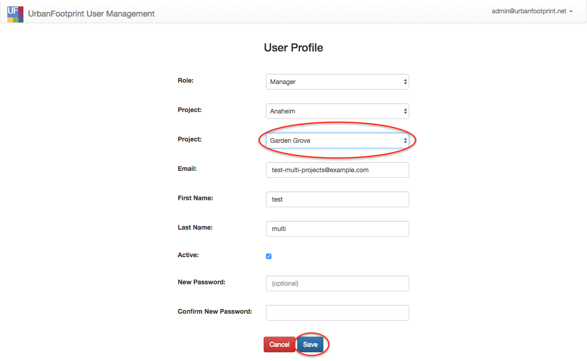

# User Manager

The User Manager allows managers and admin users to manage users in their project.

In this section you will find:

* How to update your profile
* How to create a new user
* How to update a user's profile
* How to update a user with access to multiple projects

The user manager can be accessed from the user profile dropdown 'Manage Users' in the right hand corner of UrbanFootprint.

## How to update your profile

1. In the upper right corner, click on your email address or name to expand the drop down list. From the drop down, select 'Update Profile'.

    

2. Your user profile page will look like the following:

    

3. Make the necessary changes and click 'Save' to apply the changes, or 'Cancel' to cancel. Note that when a change is made to the 'Project' drop down field,
the available roles in the 'Role' drop down list will automatically update. Not every role is available to every project. Also note that 'New Password' and
'Confirm New Password' fields are optional - they should only be completed if you want to reset your password.

## How to create a new user

1. Administrative and manager users have the ability to create new users. To add a new user, click on your email address or name in the upper right corner to
expand the drop down list and select 'Add User'.

    

2. The add user page will look like the following:

    

3. The form contains the following fields:
    1. Project - This property associates the user to a municipality (or administrative group).

        >**Note:** to create a user with access to multiple projects, see [How to update a user with access to multiple projects](/user_manager/#how-to-update-a-user-with-access-to-multiple-projects)

    2. Role - The role the user fulfills e.g.: 'Admin' or 'User'
    3. Name - This field is optional.
    4. Email - The email address of the user to be created; it must not already be used for another UrbanFootprint account.
    5. Active - If this box is unchecked, the user will not be able to log in to UrbanFootprint. It defaults to checked. Uncheck this if a user should not have
access to UrbanFootprint.
    6. Password and Confirm Password - _Users who are given a temporary password should log in to this User Manager site and update their password_.

## How to update a user's profile

1. Administrative and manager users have the ability to update the profiles of users they manage. To modify a user profile, find the user in the list view and
click on that user's row.

    

2. The update user page will look like the following:

    

3. The user's profile page will show similar fields as those described in item 3 of the section titled "How to create a new user", with one difference:
    1. New Password and Confirm New Password - These fields are optional and should be set if the user needs to have their password reset. _Users who are
given a temporary password should log in to this User Manager site and update their password_.

## How to update a user with access to multiple projects

1. Administrative and manager users have the ability to update the profiles of users they manage. Updating a user with access to multiple projects can be done one project at a time. In the User Management home page, select the user to update.

    

2. In the update user page, select the desired project access in the blank project dropdown.

    

3. Click save to add project access to the user.

    

4. To add access to another project to the same user, repeat steps 1-3.
